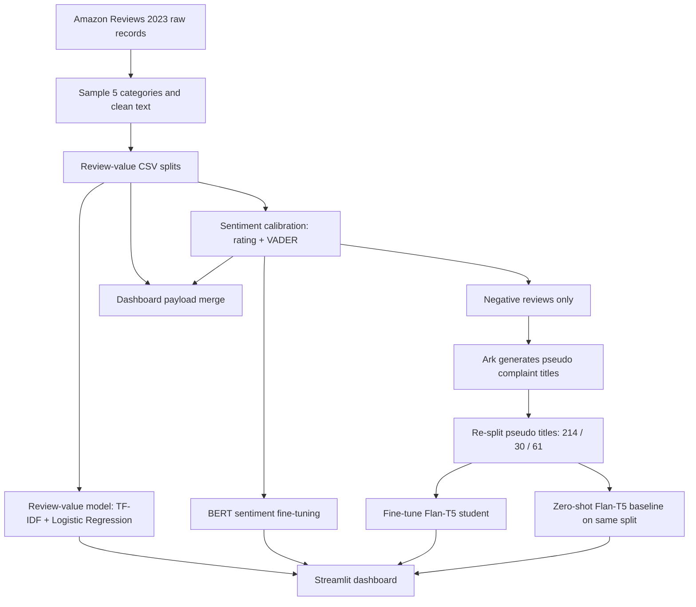

# Review Insight System Project Pipeline

本文档是项目的端到端说明，用来快速回顾项目从数据预处理、实验训练、指标评估到 Streamlit 前端展示的完整流程。后续如果上下文过长，先读这个文件，再读 `README.md` 和当前 `git status`。

当前状态基于本地工作区截至 2026-04-13 的结果。

## 1. 项目目标

本项目面向 Amazon Reviews 2023 数据，做一个商家评论洞察系统。核心目标不是单纯训练一个模型，而是把评论数据处理成可以给商家使用的分析链路：

1. 识别哪些评论可能是 high-value reviews。
2. 判断评论情感，尤其关注负面评论。
3. 对负面评论生成短的 complaint title，方便商家快速知道问题是什么。
4. 在 Streamlit dashboard 中展示类目、商品、负面主题、代表性评论、单条评论分析和商家助手。

## 2. 当前一句话总结

项目现在的正式 T5 路线是：

```text
负面评论 -> Ark/LLM 生成规范化 complaint title 作为预处理标签
       -> 重新切分 pseudo-title 数据，扩大 test set
       -> 用 pseudo titles 微调本地 Flan-T5 student
       -> dashboard 优先使用本地 student 生成标题
```

这不是可选实验，而是 complaint-title generation 任务的数据预处理和训练主线。

当前主要指标：

| Task | Test Result | Notes |
| --- | ---: | --- |
| Review value classification | Accuracy 0.840 | Positive-class F1 0.418，正类识别仍偏弱。 |
| BERT sentiment classification | F1 0.990 | 标签来自 rating + VADER 规则，不是人工标注。 |
| Pseudo-label Flan-T5-small | ROUGE-L F1 0.373 / BERTScore F1 0.834 | 在 833/118/237 split 上微调后的结果。 |
| Pseudo-label Flan-T5-base | ROUGE-L F1 0.412 / BERTScore F1 0.845 | 同一 split 上优于 Flan-T5-small。 |
| Zero-shot Flan-T5 baseline (legacy) | ROUGE-L F1 0.146 | 这是旧的 61-row split 指标，未在新 237-row split 上重跑。 |

## 3. 目录地图

```text
app/
  streamlit_app.py
    Streamlit dashboard 入口，串联数据、模型、上传分析和商家助手。

data/processed/
  review_value_train.csv
  review_value_validation.csv
  review_value_test.csv
  review_value_manifest.json
    review-value 任务数据和 manifest。

  sentiment_train.csv
  sentiment_validation.csv
  sentiment_test.csv
  sentiment_manifest.json
    rating + VADER 校准后的 sentiment 数据。

  pseudo_summary_train.csv
  pseudo_summary_validation.csv
  pseudo_summary_test.csv
  pseudo_summary_manifest.json
    Ark 生成的 complaint-title pseudo labels，已经重新切分为 833/118/237。

models/
  review_value_classifier.pkl
  review_value_metrics.json
    TF-IDF + Logistic Regression 模型和指标。

  bert_sentiment/
  bert_sentiment_metrics.json
    fine-tuned BERT 情感模型和指标。模型目录较大，被 .gitignore 忽略。

  t5_pseudo_summary/
  t5_pseudo_summary_metrics.json
  t5_pseudo_summary_samples.json
    历史 runtime student 路线（小数据版本）。模型目录较大，被 .gitignore 忽略。

  t5_pseudo_summary_small/
  t5_pseudo_summary_small_metrics.json
  t5_pseudo_summary_small_samples.json
    在扩充后的 pseudo-title 数据上微调的 Flan-T5-small。

  t5_pseudo_summary_base/
  t5_pseudo_summary_base_metrics.json
  t5_pseudo_summary_base_samples.json
    在扩充后的 pseudo-title 数据上微调的 Flan-T5-base。

  t5_summary_metrics.json
  t5_summary_samples.json
    zero-shot Flan-T5 baseline 指标和样例。

src/
  preprocessing/
    clean_text.py
    prepare_dataset.py
    generate_complaint_titles.py
    resplit_complaint_titles.py

  helpfulness/
    prepare_helpfulness_dataset.py
    train_helpfulness.py
    predict_helpfulness.py

  sentiment/
    label_calibration.py
    train_bert_sentiment.py

  summarization/
    generate_pseudo_titles.py
    fine_tune_t5_pseudo.py
    train_t5.py
    generate_summary.py

  visualization/
    dashboard_utils.py
```

## 4. 整体流程图



## 5. 数据预处理

数据一致性约束（重要）：

- 扩充 complaint-title 数据时，必须基于当前已采样的 `review_value_*.csv`。
- 不引入未采样商品或未采样类目的新评论，避免与 dashboard 商品范围对不齐。

### 5.1 构建 review-value 数据

脚本：

```bash
.venv/bin/python -m src.helpfulness.prepare_helpfulness_dataset \
  --categories All_Beauty Amazon_Fashion Appliances Handmade_Products Health_and_Personal_Care \
  --samples-per-category 2000 \
  --min-helpful-per-category 250 \
  --helpful-vote-threshold 2 \
  --limit 20000
```

输入来源是 Hugging Face 上的 Amazon Reviews 2023 raw review 和 metadata JSONL。当前选取五个类目：

- `All_Beauty`
- `Amazon_Fashion`
- `Appliances`
- `Handmade_Products`
- `Health_and_Personal_Care`

核心处理：

- 清洗 HTML、URL、空白字符。
- 过滤太短评论。
- 每个类目采样 2,000 条，共 10,000 条。
- 每个类目尽量保留 250 条 high-value 正样本。
- 加入商品标题 metadata。
- 按类目内随机切分 train / validation / test。

标签规则：

```text
review_value_label = 1 if helpful_votes >= 2 else 0
```

当前输出：

| Split | Rows |
| --- | ---: |
| Train | 8,000 |
| Validation | 1,000 |
| Test | 1,000 |

整体标签：

| Label | Rows |
| --- | ---: |
| High-value | 1,250 |
| Low-value | 8,750 |

### 5.2 校准 sentiment 标签

脚本：

```bash
.venv/bin/python -m src.sentiment.label_calibration \
  --negative-rating-max 3 \
  --negative-score-threshold 0.2
```

它不是人工标注情感，而是用 star rating 和 VADER compound score 做高置信规则标注：

```text
positive: rating >= 4 and lex_score > 0.0
negative: rating <= 3 and lex_score < 0.2
discard: otherwise
```

训练集还会下采样 positive，使 train positive : negative 最大约为 3:1。

当前输出：

| Split | Rows |
| --- | ---: |
| Train | 3,820 |
| Validation | 856 |
| Test | 836 |

整体 sentiment：

| Sentiment | Rows |
| --- | ---: |
| Positive | 4,324 |
| Negative | 1,188 |

### 5.3 生成 complaint-title pseudo labels

脚本入口：

```bash
.venv/bin/python -m src.preprocessing.generate_complaint_titles \
  --request-timeout 60
```

实际实现复用：

```text
src/summarization/generate_pseudo_titles.py
```

这一步是 complaint-title 数据预处理的必要部分。它只对 calibrated negative reviews 生成标题，因为该任务本身是 complaint title generation，不是给所有正面评论都生成标题。

需要配置：

```bash
export ARK_API_KEY="your-ark-api-key"
export ARK_MODEL="doubao-seed-2-0-lite-260215"
export ARK_BASE_URL="https://ark.cn-beijing.volces.com/api/v3"
```

脚本特点：

- 批量请求 Ark，默认 batch size 为 8。
- 要求 Ark 返回 JSON。
- 每个标题限制为短英文 complaint title。
- 拒绝星级类标题，比如 `Two Stars`。
- 拒绝过于泛化标题，比如 `bad product`。
- 如果 Ark 输出不合格，用本地 fallback 从评论中抽取短问题短语。
- 可用 `--limit 2` 做便宜 smoke test。

当前 Ark 生成情况：

| Split before re-split | Rows | Ark Titles | Fallback Titles |
| --- | ---: | ---: | ---: |
| Train | 955 | 955 | 0 |
| Validation | 116 | 116 | 0 |
| Test | 117 | 117 | 0 |

### 5.4 重新切分 pseudo-title 数据

脚本：

```bash
.venv/bin/python -m src.preprocessing.resplit_complaint_titles
```

这个脚本不会调用 Ark，不会烧 API。它把已经生成好的 1,188 条 pseudo-title rows 合并、去重，然后重新切分，目的是扩大 test set，让 T5 评估更稳定。

默认比例：

```text
train: 70%
validation: 10%
test: 20%
seed: 42
```

当前输出：

| Split | Rows |
| --- | ---: |
| Train | 833 |
| Validation | 118 |
| Test | 237 |

`pseudo_summary_manifest.json` 中会保留 `resplit` 元数据，包括 split ratio、seed 和最终 split counts。

## 6. 模型实验

### 6.1 Review-value classifier

训练命令：

```bash
.venv/bin/python -m src.helpfulness.train_helpfulness
```

模型：

```text
TfidfVectorizer(max_features=10000, ngram_range=(1, 2))
+ LogisticRegression(class_weight="balanced", solver="liblinear", C=0.5)
decision_threshold = 0.6
```

当前 test 指标：

| Metric | Value |
| --- | ---: |
| Accuracy | 0.840 |
| Positive precision | 0.434 |
| Positive recall | 0.404 |
| Positive F1 | 0.418 |

解读：

- overall accuracy 看起来还可以。
- 但 high-value 正类 F1 只有 0.418，这是弱点。
- 报告时要说明 high-value label 是 helpful votes 的代理标签，不是人工质量标签。

### 6.2 BERT sentiment classifier

训练命令：

```bash
.venv/bin/python -m src.sentiment.train_bert_sentiment
```

模型：

```text
bert-base-uncased
num_labels = 2
id2label = {0: "negative", 1: "positive"}
```

当前 test 指标：

| Metric | Value |
| --- | ---: |
| Accuracy | 0.982 |
| F1 | 0.990 |
| Macro F1 | 0.939 |

解读：

- 对规则校准标签效果很好。
- 不能直接说它在人类真实情感标注上也有 0.99 F1。
- 应写成：BERT learns the calibrated sentiment labels derived from rating and VADER signals.

### 6.3 Zero-shot Flan-T5 baseline

评估命令：

```bash
.venv/bin/python -m src.summarization.train_t5 \
  --train-file data/processed/pseudo_summary_train.csv \
  --validation-file data/processed/pseudo_summary_validation.csv \
  --test-file data/processed/pseudo_summary_test.csv \
  --target-column llm_complaint_title
```

这里虽然脚本名叫 `train_t5.py`，但它对 zero-shot baseline 不训练，只加载 `google/flan-t5-small` 直接生成并评估。

当前 test 指标（legacy 61-row split）：

| Metric | Value |
| --- | ---: |
| ROUGE-1 F1 | 0.156 |
| ROUGE-2 F1 | 0.060 |
| ROUGE-L F1 | 0.146 |
| Avg generated words | 6.93 |
| Avg reference words | 4.82 |

### 6.4 Pseudo-label T5 student

当前我们对比两个 student：

```bash
.venv/bin/python -m src.summarization.fine_tune_t5_pseudo \
  --model-name google/flan-t5-small \
  --output-dir models/t5_pseudo_summary_small \
  --metrics-output models/t5_pseudo_summary_small_metrics.json \
  --samples-output models/t5_pseudo_summary_small_samples.json \
  --allow-download \
  --bertscore-model-type distilbert-base-uncased
```

```bash
.venv/bin/python -m src.summarization.fine_tune_t5_pseudo \
  --model-name google/flan-t5-base \
  --output-dir models/t5_pseudo_summary_base \
  --metrics-output models/t5_pseudo_summary_base_metrics.json \
  --samples-output models/t5_pseudo_summary_base_samples.json \
  --allow-download \
  --bertscore-model-type distilbert-base-uncased
```

训练数据：

| Split | Rows |
| --- | ---: |
| Train | 833 |
| Validation | 118 |
| Test | 237 |

训练配置：

| Config | Value |
| --- | --- |
| Base models | `google/flan-t5-small`, `google/flan-t5-base` |
| Epochs | 5 |
| Train batch size | 4 |
| Eval batch size | 8 |
| Learning rate | 3e-4 |
| Target column | `llm_complaint_title` |
| Extra metric | `bertscore_f1` (`distilbert-base-uncased`) |

当前 test 指标（small vs base）：

| Metric | Value |
| --- | ---: |
| Flan-T5-small ROUGE-1/2/L F1 | 0.393 / 0.187 / 0.373 |
| Flan-T5-small BERTScore F1 | 0.834 |
| Flan-T5-base ROUGE-1/2/L F1 | 0.435 / 0.230 / 0.412 |
| Flan-T5-base BERTScore F1 | 0.845 |
| Avg generated words | small 4.95 / base 4.85 |
| Avg reference words | 4.82 |

当前主对比（同一 237-row split）：

| Model | Test Rows | ROUGE-1 F1 | ROUGE-2 F1 | ROUGE-L F1 | BERTScore F1 |
| --- | ---: | ---: | ---: | ---: | ---: |
| Flan-T5-small (pseudo-label tuned) | 237 | 0.393 | 0.187 | 0.373 | 0.834 |
| Flan-T5-base (pseudo-label tuned) | 237 | 0.435 | 0.230 | 0.412 | 0.845 |

推荐报告写法：

```text
On the expanded 237-row pseudo-title test split, Flan-T5-base outperforms Flan-T5-small, reaching ROUGE-L F1 0.412 and BERTScore F1 0.845.
```

不要报告 exact match。短标题生成有多个合理表达，exact match 会低估语义质量，也容易被老师质疑。

## 7. ROUGE 指标怎么来的

ROUGE 指标在 `src/summarization/train_t5.py` 中手写实现，没有额外依赖。

当前输出：

- `avg_unigram_f1`
- `rouge1_f1`
- `rouge2_f1`
- `rougeL_f1`
- `bertscore_f1`
- `avg_generated_words`
- `avg_reference_words`

其中：

- ROUGE-1 F1 看 unigram overlap。
- ROUGE-2 F1 看 bigram overlap。
- ROUGE-L F1 看最长公共子序列。
- BERTScore F1 用 contextual embeddings 看语义相似度。

对短标题任务，报告中建议主看 `ROUGE-L F1`，辅看 `ROUGE-1/2 F1` 和 `BERTScore F1`。

## 8. Streamlit 前端 pipeline

启动命令：

```bash
.venv/bin/streamlit run app/streamlit_app.py
```

不要用：

```bash
python app/streamlit_app.py
```

Dashboard 默认只展示 held-out test set，常量是：

```text
DEMO_SPLIT = "test"
```

主要 tab：

1. `Business Overview`
   - 展示 review-value accuracy、BERT sentiment F1、T5 ROUGE-L F1。
   - 展示 test set 的 review 数、negative 数、high-value negative 数。
   - 展示类目分布、投诉关键词和生成标题样例。

2. `Issue Explorer`
   - 支持按 category 和 product 过滤。
   - 展示当前 scope 的代表性 negative reviews。
   - 可对代表性负面评论生成 AI complaint titles。

3. `Single Review Check`
   - 用户粘贴一条评论。
   - 依次跑 review-value classifier、BERT sentiment、T5 complaint title。
   - 只有负面评论才生成 complaint title。

4. `Merchant Upload`
   - 商家上传 CSV。
   - 至少需要 `review_text` 列。
   - 最多一次分析 50 行，避免本地 BERT/T5 太慢。

5. `Merchant Copilot`
   - 对当前 scope 的数据做问答。
   - 如果配置 `ARK_API_KEY`，优先用 Ark 给更自然的商家建议。
   - 没有 key 时走本地规则 fallback。

## 9. 标题生成 runtime fallback

`app/streamlit_app.py` 中 `summarize_issue()` 的 fallback 链如下：

```text
1. 如果 models/t5_pseudo_summary/config.json 存在：
     使用本地 pseudo-label T5 student。

2. 如果本地 student 不存在或加载失败：
     如果 ARK_API_KEY 可用，调用 Ark 直接生成 complaint title。

3. 如果 Ark 不可用：
     尝试使用缓存的 zero-shot google/flan-t5-small。

4. 如果 zero-shot T5 也不可用：
     使用本地 heuristic 从评论中抽取短标题。
```

还有一个重要后处理：

- 如果源评论里有明确否定，比如 `not`, `never`, `don't`, `cannot`；
- 但模型生成标题没有任何否定或问题信号；
- 则回退到启发式标题，避免出现 `Caps stay on pencils` 这种丢掉否定的坏标题。

示例：

```text
Input:
The caps do not stay on the pencils and the tips keep getting ruined.

Protected output:
The caps do not stay on the pencils
```

## 10. 推荐完整重跑顺序

如果从头重建当前结果，按这个顺序跑：

```bash
# 1. Build review-value dataset
.venv/bin/python -m src.helpfulness.prepare_helpfulness_dataset \
  --categories All_Beauty Amazon_Fashion Appliances Handmade_Products Health_and_Personal_Care \
  --samples-per-category 2000 \
  --min-helpful-per-category 250 \
  --helpful-vote-threshold 2 \
  --limit 20000

# 2. Calibrate sentiment labels
.venv/bin/python -m src.sentiment.label_calibration \
  --negative-rating-max 3 \
  --negative-score-threshold 0.2

# 3. Generate Ark pseudo complaint titles
.venv/bin/python -m src.preprocessing.generate_complaint_titles

# 4. Re-split pseudo-title labels to expand test set
.venv/bin/python -m src.preprocessing.resplit_complaint_titles

# 5. Train review-value classifier
.venv/bin/python -m src.helpfulness.train_helpfulness

# 6. Fine-tune BERT sentiment classifier
.venv/bin/python -m src.sentiment.train_bert_sentiment

# 7a. Fine-tune pseudo-label Flan-T5-small
.venv/bin/python -m src.summarization.fine_tune_t5_pseudo \
  --model-name google/flan-t5-small \
  --output-dir models/t5_pseudo_summary_small \
  --metrics-output models/t5_pseudo_summary_small_metrics.json \
  --samples-output models/t5_pseudo_summary_small_samples.json \
  --allow-download \
  --bertscore-model-type distilbert-base-uncased

# 7b. Fine-tune pseudo-label Flan-T5-base
.venv/bin/python -m src.summarization.fine_tune_t5_pseudo \
  --model-name google/flan-t5-base \
  --output-dir models/t5_pseudo_summary_base \
  --metrics-output models/t5_pseudo_summary_base_metrics.json \
  --samples-output models/t5_pseudo_summary_base_samples.json \
  --allow-download \
  --bertscore-model-type distilbert-base-uncased

# 8. (Optional legacy) Evaluate zero-shot T5 baseline
.venv/bin/python -m src.summarization.train_t5 \
  --train-file data/processed/pseudo_summary_train.csv \
  --validation-file data/processed/pseudo_summary_validation.csv \
  --test-file data/processed/pseudo_summary_test.csv \
  --target-column llm_complaint_title

# 9. Launch dashboard
.venv/bin/streamlit run app/streamlit_app.py
```

只有第 3 步会调用 Ark API。第 4 步不会调用 API。

## 11. 重要 caveats

1. `review_value_label` 是 helpful votes 的代理标签，不是人工高质量评论标签。

2. Sentiment labels 是 `rating + VADER` 规则校准，不是人工标注。BERT 的高 F1 说明它学到了规则标签，不代表真实情感识别达到 0.99。

3. Complaint-title labels 是 Ark 生成的 pseudo labels，不是 human gold labels。T5 student 的提升说明 teacher-generated normalized titles 有帮助，但指标仍应被解释为 demo-oriented evaluation。

4. T5 test set 已从 25 扩到 61，但整体仍然偏小。报告里可以说 expanded test split，而不要夸大成大规模评估。

5. `models/bert_sentiment/`, `models/t5_summary/`, `models/t5_pseudo_summary/` 是大模型目录，被 `.gitignore` 忽略。GitHub 上通常只保留 metrics、samples 和小的 sklearn bundle。

6. 如果老师 clone 仓库但没有本地 T5 student，dashboard 会尝试 Ark fallback；如果 Ark key 也没有，会尝试 zero-shot T5；如果本地也没有 Hugging Face cache，则最后用 heuristic title，避免页面直接崩掉。

## 12. 后续如果继续优化

优先级建议：

1. 为 T5 title generation 做 30 到 50 条人工小样本评分。
   - `0`: wrong or misleading
   - `1`: partially captures issue
   - `2`: accurately captures main complaint

2. 改进 review-value classifier 正类 F1。
   - 加入 `rating`, `verified_purchase`, `review_text_word_count`, `category` 等结构化特征。
   - 尝试 threshold tuning 或 PR curve。

3. 加最小测试集。
   - `clean_text`
   - sentiment label rules
   - pseudo-title re-split counts
   - ROUGE metric functions
   - dashboard payload merge

4. 让 dashboard 的模型缺失提示更友好。
   - 当前有 fallback，但模型加载失败时仍然可以再加强 UI message。

## 13. 未来 Codex 接手提示

如果以后上下文过长，先做下面几步：

```bash
git status -sb
sed -n '1,260p' PROJECT_PIPELINE.md
sed -n '1,260p' README.md
python3 - <<'PY'
import json
for path in [
    'models/review_value_metrics.json',
    'models/bert_sentiment_metrics.json',
    'models/t5_summary_metrics.json',
    'models/t5_pseudo_summary_metrics.json',
]:
    data = json.load(open(path))
    print(path, data.get('dataset_sizes'), data.get('test'))
PY
```

除非用户明确要求重新生成 pseudo titles，否则不要重新调用 Ark。优先复用 `data/processed/pseudo_summary_*.csv`。
